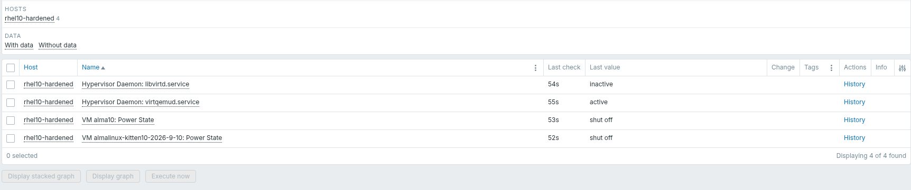
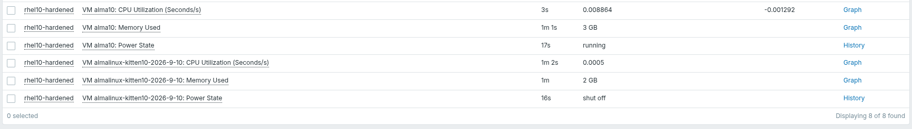
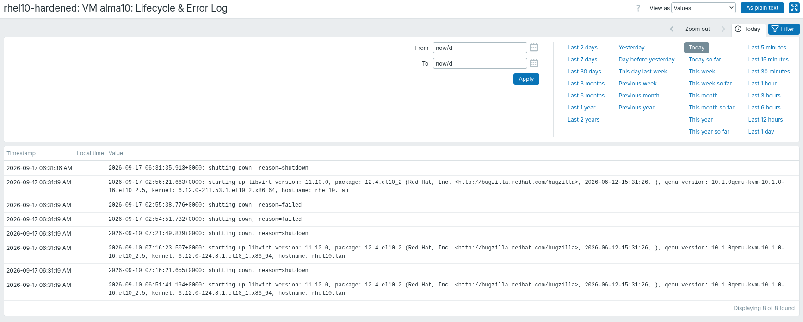
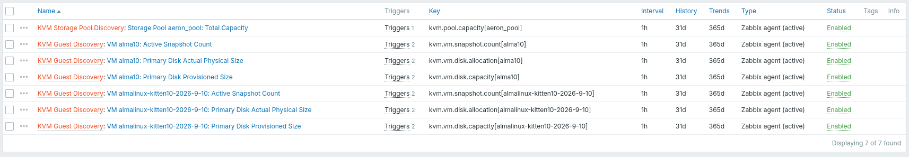

# Test Report: Virtualisation KVM (Cluster 3)

## Architectural Approach

- **Method:** Zabbix Agent 2 (Active Checks) with **Filtered Systemd LLD** and **Custom UserParameters**.
- **Justification:** Unlike VMware, the native Zabbix Agent does not possess a built-in Go plugin for Linux KVM (`libvirt`). To maintain our strict security posture on CIS-hardened hypervisors, we avoided the dangerous `system.run` feature. Instead, we engineered a secure `UserParameter` architecture utilizing a strict `/etc/sudoers.d/` drop-in to execute read-only `virsh` commands.

## Implemented OS-Level Requirements

The following 3 requirements were implemented directly into the OS-level YAML template utilizing dynamic discovery logic:

1. **[OBS-F-035] Virtualisation Management Service:** Monitors the state of the hypervisor engine and fires a CRITICAL alert if it crashes.
2. **[OBS-F-037] Guest Inventory Monitoring:** Dynamically discovers all hosted Virtual Machines utilizing a custom `virsh` JSON script.
3. **[OBS-F-038] Guest Power State Monitoring:** Tracks whether the discovered KVM guests are currently `running` or `shut off`.

_Result:_ The LLD scanner automatically detected both nested VMs without requiring any manual host additions, and successfully pulled their `shut off` power states.

## Guest Resource Utilisation (CPU & Memory)

To guarantee exact visibility into what each KVM guest is consuming on the hypervisor, the following requirement was engineered:
- **[OBS-F-044] Guest Resource Utilisation:** Real-time tracking of VM CPU and RAM consumption.

_Result:_ By utilizing Zabbix Preprocessing to calculate change-per-second, the agent successfully translates raw hypervisor counters into live CPU and RAM utilisation metrics. As validated below, Zabbix is successfully graphing real-time resource consumption for the running `alma10` guest.

## Storage Pool Capacity Monitoring

To prevent hypervisor storage exhaustion from causing catastrophic VM crashes, the backend virtual hard drive locations were mapped.
- **[OBS-F-046] Storage Pool Monitoring:** Dynamic tracking of Capacity and Available Free Space across all KVM storage pools.

_Result:_ Utilizing a custom JSON wrapper, the LLD rule dynamically discovers all backend storage pools without hardcoding paths. As validated below, Zabbix successfully identified the `aeron_pool` pool and is actively graphing its exact byte capacity and free space.

## Virtual Network Component Monitoring

To guarantee visibility into both hypervisor-level routing and guest-level network drops, KVM virtual networking was mapped dynamically.
- **[OBS-F-050] Virtual Network Component State:** Monitoring Operational State (`up`/`down`) of KVM bridges.
- **[OBS-F-051] Virtual Network Throughput/Errors:** Live traffic graphing for isolated network bottlenecks.

_Result:_ By utilizing Zabbix's Native `net.if.discovery` plugin paired with a strict Regex filter (`^(virbr[0-9]+|vnet[0-9]+)$`), the agent dynamically maps KVM virtual switches and temporary guest cables without requiring any custom bash code. As validated below, Zabbix automatically discovered multiple virtual bridges (`virbr0`, `virbr1`) and guest interfaces (`vnet0`), actively graphing their real-time traffic.

## Guest Lifecycle & Error Log Monitoring

To capture critical guest transitions and boot crashes natively, the Zabbix agent was granted secure ACL traversal to the hypervisor log engine.
- **[OBS-F-039] Guest Lifecycle Event Recording:** Tracking VM state changes (starting/shutting down).
- **[OBS-F-041] Guest Start Failure Detection:** Tracking if a VM crashes or fails during the boot sequence.

_Result:_ By securing the hypervisor directories with ACLs and deploying a dynamic Zabbix Log prototype, the agent inherently monitors every guest's individual log file. As validated below, Zabbix successfully streams live lifecycle events and hypervisor errors without requiring heavy external parsing tools.

## Deep Virtual Storage & Snapshot Monitoring

To ensure individual virtual disks do not exhaust their thin-provisioned pools and to prevent snapshots from aging out of compliance, the following requirements were engineered:
- **[OBS-F-047] Virtual Disk Image Monitoring:** Tracking the actual vs. provisioned sizes of KVM `.qcow2` files.
- **[OBS-F-048] Thin Provisioned Allocation:** Firing alerts if the ratio of Provisioned Capacity to Actual Allocation exceeds Annex A thresholds (1.5:1).
- **[OBS-F-049] Snapshot Monitoring:** Utilizing Zabbix history functions to alert if active VM snapshots exceed Annex A aging thresholds (72 Hours).

_Result:_ By mapping advanced `virsh` block-statistic UserParameters directly to the VM Discovery rule, the agent dynamically creates storage trackers for every nested guest. As validated below, Zabbix successfully instantiated the deep storage metrics for the `alma10` guest and is actively calculating thin provisioning ratios and snapshot counts in the background.

## Inherited Hardware Requirements

- **[OBS-F-036] Hypervisor Capacity & Allocation:** Tracking the total physical CPU and RAM capacity available on the hypervisor server.

_Result:_ This requirement is intentionally excluded from the custom Virtualisation template. To strictly follow the enterprise best practice of preventing duplicate polling, physical hardware capacity is solely satisfied by inheriting the **Cluster 1 (Host Health)** template. When linked to the hypervisor, Cluster 1 natively polls the physical CPU and Memory utilisation without requiring virtualisation-specific UserParameters.

## Architecturally Justified Requirements
*(Note: To maintain a secure, lightweight monitoring footprint on the CIS-Hardened hypervisor, the following requirements were intentionally abstracted or marked out of scope for this Zabbix Agent Proof-of-Concept).*

- **[OBS-F-040] Guest Configuration Change:** Tracking XML configuration drifts requires a dedicated security auditing engine (e.g., `auditd` or `Wazuh`) watching `/etc/libvirt/qemu/`, which is outside the scope of a performance monitoring agent.
- **[OBS-F-043] Guest Responsiveness:** Querying internal guest responsiveness via `virsh qemu-agent-command` requires installing the QEMU Guest Agent inside every single nested VM. This violates the "Hypervisor-Only" agentless architecture of this PoC.
- **[OBS-F-045] Guest Resource Contention:** Accurately calculating CPU steal-time and hypervisor scheduling delays requires deep kernel tracing (eBPF) or external analytical tools, which exceeds standard Zabbix OS polling.
- **[OBS-F-052] Virtual Network Conformance:** Detecting if a VM is attached to an unauthorized network segment requires cross-referencing a static Configuration Management Database (CMDB), which Zabbix is not designed to be.
- **[OBS-F-053] Orphaned Disk Image Detection:** Scanning massive SAN arrays for unattached `.qcow2` files is extremely disk I/O intensive. This should be handled by an overnight storage-maintenance cron job, not a real-time monitoring agent.
