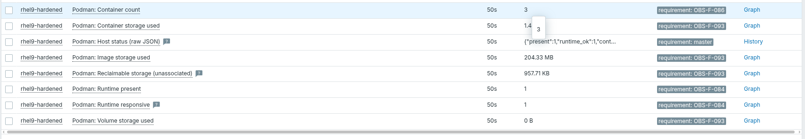
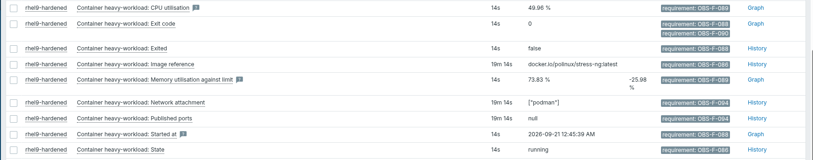

# Test Report: Containers (Cluster 4)

**Host:** `rhel9-hardened` (CIS hardened, Podman 5.8.2, `zabbix-agent2-8.0.0-beta2`)
**Template:** `Scope Containers`
**Collection:** one UserParameter (`podman.status`) → one JSON document → all
items derived as Zabbix dependent items.

Rationale for the collection method is in `zabbix_containers_matrix.md`;
requirement and threshold coverage is tracked in `coverage_containers.md`.

## 1. Agent-side verification

Checked as the agent's own service account before importing the template, so
permission and sudoers faults surface immediately rather than as a red error in
the GUI sixty seconds later.

```bash
sudo -u zabbix /etc/zabbix/scripts/podman_status.sh | head -c 400
{"present":1,"runtime_ok":1,"containers":[ ...
```

## 2. Host-level collection

All eight host items populated. Every item carries a `requirement` tag, so
*Latest data* can be filtered by requirement ID.



- **[OBS-F-084]** `Runtime present` = 1, `Runtime responsive` = 1
- **[OBS-F-086]** `Container count` = 3
- **[OBS-F-093]** Image 204.33 MB, container storage 1.4 MB, volumes 0 B,
  reclaimable 957.71 KB

## 3. Per-container discovery

Low-Level Discovery instantiated the nine item prototypes against each
discovered container. Values shown for `heavy-workload`.



- **[OBS-F-086]** State `running`, image `docker.io/polinux/stress-ng:latest`
- **[OBS-F-088]** `Exited` = false, `Exit code` = 0, `Started at` populated
- **[OBS-F-089]** CPU 49.96 %, memory 73.83 % of its configured limit
- **[OBS-F-094]** Network `["podman"]`, published ports `null`

Three design assumptions were confirmed here: Zabbix accepts `.length()` for
the container count, the JSON boolean renders as the string `false` (so the
abnormal-exit trigger compares against `"true"`), and the regex preprocessing
correctly strips the `%` suffix Podman returns on CPU and memory.

## 4. Alarm verification

`heavy-workload` runs `stress-ng` under a 256 MB limit and cycles between roughly
74% and 99.96% of that limit, crossing the `OBS-TH-037` critical threshold.


**[OBS-F-089 / OBS-TH-037]** Memory use against the container's configured limit
reached 95%, raising the HIGH alarm with the container identified by name.

The trigger evaluates the value as collected, with no averaging or observation
window, because `OBS-TH-037` specifies a threshold and no duration. Each
crossing is therefore recorded as its own event. Where the spreadsheet *does*
specify a duration the template honours it: `OBS-TH-036` uses a ten-minute
window because the threshold is written as "3 restarts in 10 min".

Because `stress-ng` allocates and frees in a cycle, the alarm raises when a
reading crosses 95% and clears on the next reading below it. The full sequence
is preserved in *Monitoring → Problems* with **Show** set to *History*.

## 5. Notes

- Podman is daemonless: `--restart=always` did not restart a crashed container
  and `Restarts` stayed at 0 for two days. Restart detection therefore uses
  `changecount()` on the container's `StartedAt` timestamp, which changes on
  every genuine start. Test 4 uses a systemd-supervised container to produce
  real restarts rather than simulated values.
- Exit code 137 is SIGKILL, the signal the kernel OOM killer sends, and is used
  as the memory-kill signal for OBS-F-090.
- On a host without Podman the script returns `present=0` with empty arrays,
  discovery finds nothing and no trigger fires, so the same template is safe to
  link to every host.
