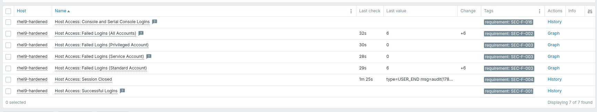
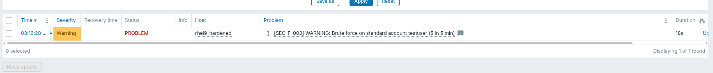

# Test Report: Host Access (Cluster 6)

**Host:** `rhel9-hardened` (CIS hardened, RHEL 9.8, `zabbix-agent2-8.0.0-beta2`)
**Template:** `Scope Host Access`
**Log source:** `/var/log/audit/audit.log` (auditd) — not `/var/log/secure`

Native agent log checks (`log[]`, `log.count[]`). No scripts, no `sudo` granted
to the agent. Rationale in `zabbix_host_access_matrix.md`, engineering detail in
`study_guide_host_access.md`.

## 1. Prerequisite

Audit log access was configured during the Privileged Activity cluster and is
reused here — `log_group = zabbix` in `/etc/audit/auditd.conf` plus an
execute-only ACL on `/var/log/audit` for directory traversal.

```
$ sudo ls -l /var/log/audit/audit.log
-rw-r-----. 1 root zabbix 30422 Sep 21 10:25 /var/log/audit/audit.log

$ sudo -u zabbix head -1 /var/log/audit/audit.log
type=CRYPTO_KEY_USER msg=audit(...) ... res=success'UID="root" AUID="unset"
```

No rsyslog dependency. Demonstrated by stopping rsyslog and confirming audit
continues to record while `/var/log/secure` freezes.

## 2. Collection



| Requirement | Item | Expected |
| :--- | :--- | :--- |
| SEC-F-001 | Successful Logins | a `USER_LOGIN ... res=success` record |
| SEC-F-002 | Failed Logins (All Accounts) | integer count |
| SEC-F-003 | Failed Logins (Privileged / Standard / Service) | integer counts |
| SEC-F-004 | Session Closed | a `USER_END` record |
| SEC-F-016 | Console and Serial Console Logins | populated only on console access |

## 3. Threshold verification



Annex B values, implemented exactly:

| Threshold | Class | Warning | Critical | Window |
| :--- | :--- | :--- | :--- | :--- |
| SEC-TH-001 | Service | 3 | 5 | 10 min |
| SEC-TH-002 | Standard | 5 | 8 | 5 min |
| SEC-TH-003 | Privileged | 3 | 5 | 5 min |

`log.count[]` counts matching records on the agent and sends an integer each
minute; `sum()` evaluates that numeric stream against the threshold.

## 4. Test procedure

```bash
# SEC-F-001 / SEC-F-004 — successful login and logout
ssh frqadmin@localhost        # then exit

# SEC-F-003 / SEC-TH-003 — privileged account, 3 failures triggers WARNING
ssh frqadmin@localhost        # enter a wrong password 3 times

# SEC-F-002 — any other account contributes to the all-accounts count
ssh nosuchuser@localhost

# SEC-F-016 — log in at the VM console rather than over SSH
```

## 5. Notes and limitations

- **Record type was verified by measurement.** Three wrong passwords in one
  `ssh` session produced `USER_AUTH res=failed` +3 and `USER_LOGIN res=failed`
  +1. Annex B counts attempts, so the failed-login items count `USER_AUTH`;
  `USER_LOGIN` is per connection and would have undercounted by the number of
  retries sshd allows. The items additionally filter on the login service
  (`sshd`, `login`) because sudo also writes `USER_AUTH` records.
- **`acct=` on a rejected account.** When sshd refuses an account outright, the
  record may carry `acct="(unknown)"` rather than the attempted name — observed
  when testing direct root login with `PermitRootLogin no`. Such attempts are
  captured by the all-accounts SEC-F-002 item but do not reach a per-account
  threshold. Verify the per-account patterns against a real failed login for an
  account that exists.
- **SEC-F-016 is partial.** Physical console (`terminal=tty1`) and serial
  console (`terminal=ttyS0`) are recorded. The platform management controller
  (iDRAC/iLO) bypasses the OS and needs an IPMI/Redfish template.
- **SEC-TH-004 and SEC-TH-005 remain out of scope.** They count per source
  address across accounts; `addr=` is present in every record, but Zabbix cannot
  aggregate over an unbounded key space. Deferred to Wazuh.
- **`{$HA_STD_ACCOUNT}` defaults to `testuser`,** which does not exist on this
  host. Create it or point the macro at a real standard interactive account
  before SEC-TH-002 can be tested.

## 6. Note on import

Items will collect while no triggers exist, with no error shown. The Zabbix
import dialog has per-entity checkboxes; **Triggers → Create new** must be ticked
or triggers are silently skipped.
