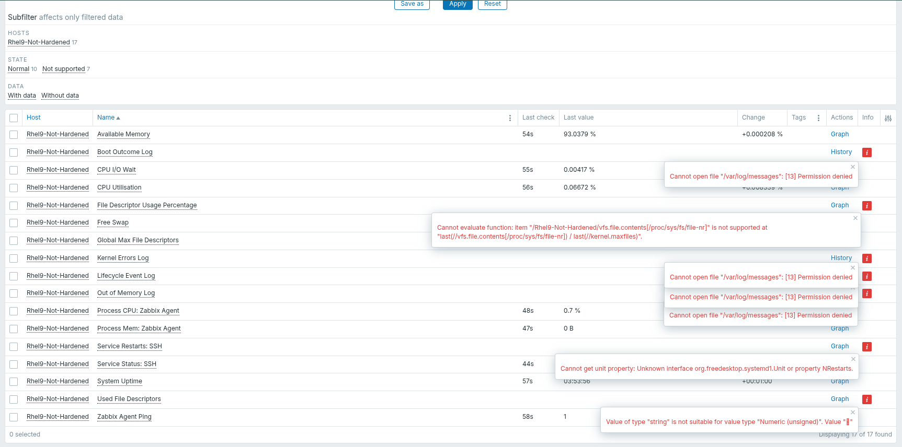
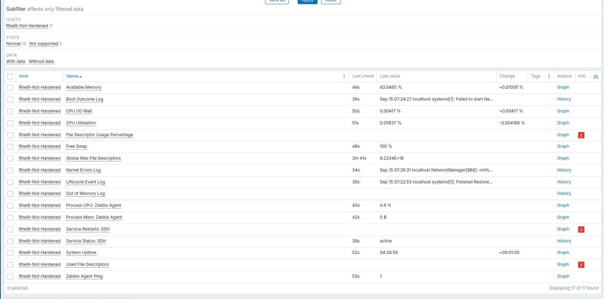
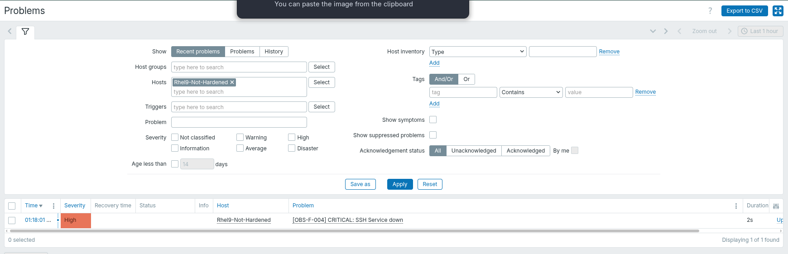

# Test Report: Host Health & Availability

## Architectural Approach

- **Method:** Zabbix Agent 2 (Active Checks).
- **Security Justification:** Requires zero inbound firewall ports. Uses 100% Native Checks. The dangerous `system.run` feature was strictly avoided to prevent Remote Code Execution (RCE) vulnerabilities.

## Pending Production Clarifications

Because this template acts as a Proof-of-Concept, generic standards were utilized to test the logic. Clarification is required on the following items before production rollout:

- **[OBS-F-004] Services:** The `sshd` service was targeted as a generic test service. Please provide the exact list of operational services to monitor.
- **[OBS-F-016] Critical Processes:** The `zabbix_agent2` process was targeted to test CPU/Mem limits. Please provide the exact application processes to monitor.

## Metric Collection & Initial Error Discovery

- **Action:** Deployed the static template directly to the RHEL 9 VM via Ansible.
- **Result:** Below is the initial Latest Data ingestion, revealing expected security restrictions and parsing errors.

### Initial Error Context:

1. **The Log Items (`Permission Denied`):** Linux blocked the agent from reading `/var/log/messages` because the agent runs securely as a non-root user.
2. **File Descriptors (`Value of type string`):** The native kernel read succeeded, but Zabbix's internal Regex preprocessing failed to isolate the integer.
3. **Service Restarts (`Unknown property NRestarts`):** Systemd only tracks `NRestarts` if a service has `Restart=on-failure` configured in its unit file (default `sshd` does not).

## Remediation & Fixes Applied

To resolve the critical log monitoring requirement without compromising the Linux security boundary, I applied a strict Access Control List (ACL) exception.

- **The Fix:** Executed `setfacl -m u:zabbix:r /var/log/messages` on the RHEL OS.
- **Why it is secure:** This surgically granted read access to this single file without elevating the Zabbix agent to root privileges.

**[Post-Remediation Verification]**
_(The log errors are resolved and natively collecting data)_

## Threshold Trigger Verification

- **Action:** Manually stopped the `sshd` service on the RHEL node to test the threshold logic.
- **Result:** Zabbix instantly detected the `inactive` state and fired the designated `[OBS-F-004]` CRITICAL alarm.

**[Trigger Alert Proof]**

