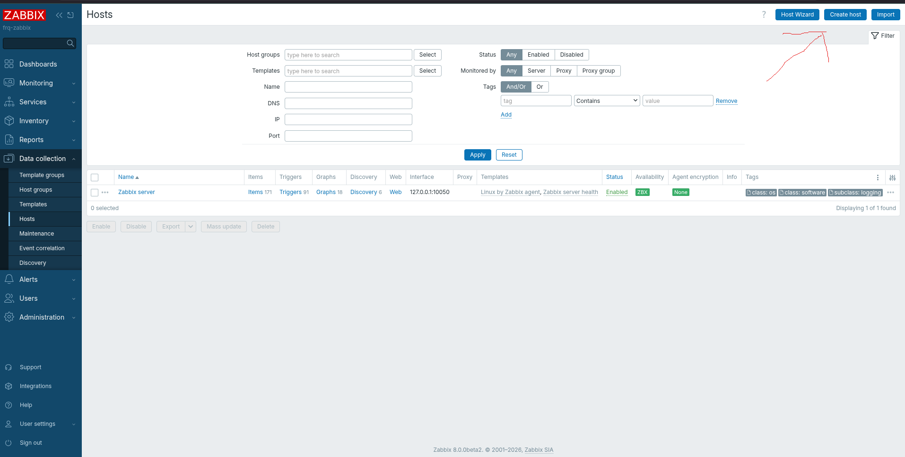
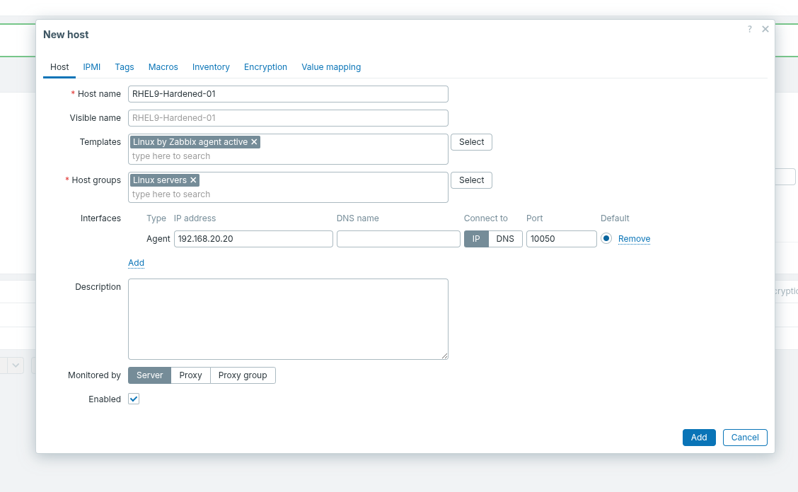
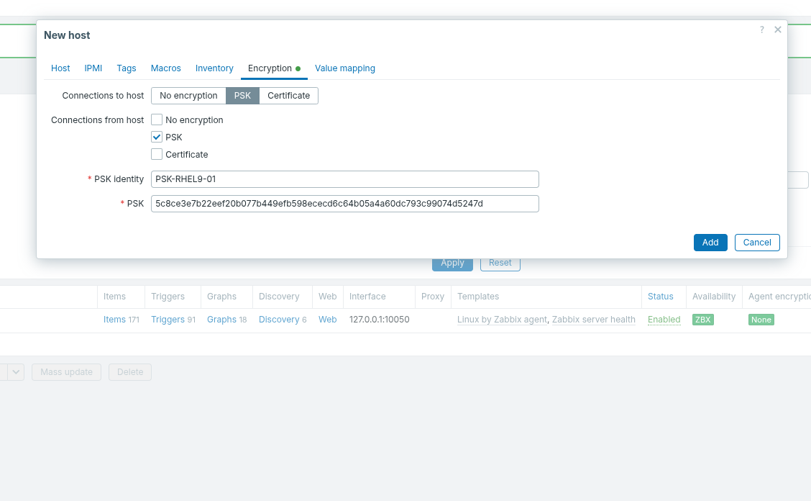
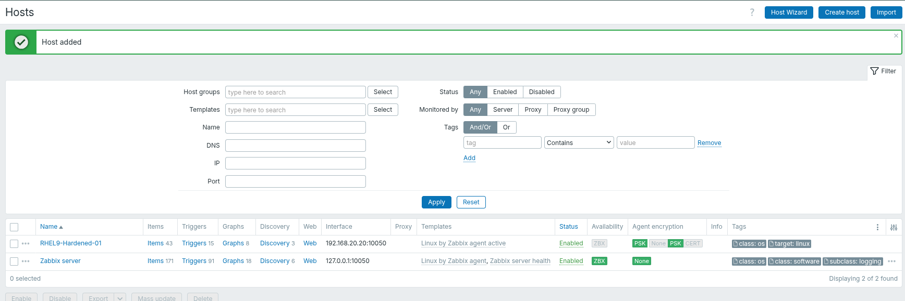

# Secure Zabbix Agent 2 Installation on RHEL 9

## Architecture & Communication Flow (How it Works)

In a standard monitoring setup, the central server reaches out to the agents to ask for data (Passive Checks). We completely reversed this for your hardened environment by using **Active Checks** and **PSK Encryption**. Here is exactly how the architecture works:

**1. The Network Flow (Port 10051)**
Because we configured `ServerActive=192.168.20.10`, the RHEL 9 Agent initiates the connection outward to the Zabbix Server on port 10051. The Zabbix Server never reaches into your RHEL 9 VM. This means your RHEL 9 firewall remains completely locked down with zero inbound ports opened.

**2. The Cryptographic Handshake (PSK)**
When the Agent knocks on the Zabbix Server's door, it introduces itself using the `Hostname` (RHEL9-Hardened-01) and the `TLSPSKIdentity` (PSK-RHEL9-01).
The Zabbix Server immediately checks the settings we configured in the Web UI. Because the Hostname matches, and the 64-character PSK we pasted into the UI matches the key file on the VM, they create a heavily encrypted tunnel. If someone intercepts the network traffic, all they see is scrambled data.

**3. The Template Checklist**
Once the encrypted tunnel is established, the Zabbix Server hands the Agent the "Template" (the checklist of metrics). The Agent takes this list, gathers all the CPU, Memory, and Disk data locally on the RHEL 9 VM, encrypts it, and pushes the answers back to the server.

---

## Phase 1: Installation

**1. Add Zabbix 8.0 Repository**
Installs the official Zabbix 8.0 repository tailored for RHEL 9.

```bash
rpm -Uvh https://repo.zabbix.com/zabbix/8.0/release/rhel/9/noarch/zabbix-release-latest-8.0.el9.noarch.rpm
```

**2. Clean Package Cache**
Clears the package manager cache to ensure it fetches the latest repository data.

```bash
dnf clean all
```

**3. Install Zabbix Agent 2**
Installs the modern, Go-based Zabbix Agent 2 and its required SELinux policies.

```bash
dnf install zabbix-agent2 zabbix-selinux-policy -y
```

---

## Phase 2: Cryptographic Key Generation

**1. Generate the PSK**
Generates a 64-character random cryptographic string and saves it directly to a key file.

```bash
openssl rand -hex 32 > /etc/zabbix/zabbix_agent2.psk
```

**2. Restrict File Ownership**
Transfers ownership of the key file strictly to the background zabbix user.

```bash
chown zabbix:zabbix /etc/zabbix/zabbix_agent2.psk
```

**3. Restrict File Permissions**
Locks down the file so absolutely no other users on the system can read the encryption key.

```bash
chmod 600 /etc/zabbix/zabbix_agent2.psk
```

**4. View the Key for the Web UI**
Prints the key to the screen so you can copy it (you will need to paste this into the Zabbix dashboard).

```bash
cat /etc/zabbix/zabbix_agent2.psk
```

---

## Phase 3: Agent Configuration

**1. Open the Configuration File**
Opens the main Zabbix Agent 2 configuration file.

```bash
vi /etc/zabbix/zabbix_agent2.conf
```

**2. Apply Secure Settings**
Add these exact lines (without `#` symbols) to instruct the agent to push data securely.

```ini
# Comment out the passive server line by adding a hash
# Server=127.0.0.1

# Tell the agent where to push the data
ServerActive=192.168.20.10

# Give the agent a unique identity
Hostname=RHEL9-Hardened-01

# Force the agent to encrypt outgoing data
TLSConnect=psk

# Force the agent to only accept encrypted incoming commands
TLSAccept=psk

# Assign a name to your encryption key
TLSPSKIdentity=PSK-RHEL9-01

# Tell the agent exactly where the key file is located
TLSPSKFile=/etc/zabbix/zabbix_agent2.psk
```

---

## Phase 4: Start Services

**1. Enable and Start the Agent**
Starts the agent immediately and configures it to run automatically when the VM boots.

```bash
systemctl enable --now zabbix-agent2
```

---

## Phase 5: Zabbix Web UI Registration

Because this is a highly secure setup, the Zabbix Server will actively drop the agent's connection until you officially register the exact Hostname and PSK in the dashboard.

**1. Create the Host**
In the Zabbix Web UI, navigate to **Data collection** -> **Hosts** and click the **Create host** button in the top right corner.


**2. Configure the Host Tab**
Fill out the main host configuration screen:

- **Host name:** `RHEL9-Hardened-01` _(This MUST match the agent's config file exactly)_
- **Templates:** `Linux by Zabbix agent active` _(You must select the 'active' variant of the template)_
- **Host groups:** Select `Linux servers`
- **Interfaces:** Click Add -> Agent. Set the IP address to your RHEL 9 VM's IP (`192.168.20.20`).
  

**3. Retrieve and Configure the Encryption Tab**
To securely connect, you need the PSK you generated earlier. If you need to view it again, run this command on your RHEL 9 VM:

```bash
cat /etc/zabbix/zabbix_agent2.psk
```

In the Zabbix Web UI, click the **Encryption** tab and fill out the fields:

- **Connections to host:** Check `PSK`
- **Connections from host:** Check `PSK`
- **PSK identity:** `PSK-RHEL9-01`
- **PSK:** Paste the 64-character string outputted by the command above.
  

**4. Finalize and Verify**
Click the **Add** button at the bottom of the screen. Within 60 seconds, the Zabbix Server will verify the encryption key, and metric data will securely begin flowing.

