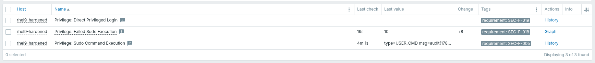
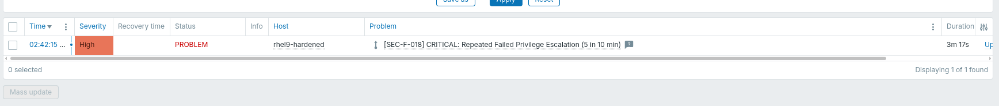

# Test Report: Privileged Activity (Cluster 5)

**Host:** `rhel9-hardened` (CIS hardened, RHEL 9.8, `zabbix-agent2-8.0.0-beta2`)
**Template:** `Scope Privileged Activity`
**Log source:** `/var/log/audit/audit.log` (auditd) — not `/var/log/secure`

Native agent log checks (`log[]`, `log.count[]`). No scripts, no `sudo` granted
to the agent. Rationale in `zabbix_privileged_activity_matrix.md`, engineering
detail in `study_guide_privileged_activity.md`.

## 1. Log source is independent of rsyslog

auditd receives events from the kernel audit netlink socket and writes its own
log, so this cluster keeps working with rsyslog stopped.

```
$ sudo grep -E '^log_group|^log_format' /etc/audit/auditd.conf
log_group = zabbix
log_format = ENRICHED

$ sudo ls -l /var/log/audit/audit.log
-rw-r-----. 1 root zabbix 30422 Sep 21 10:25 /var/log/audit/audit.log
```

Ownership is applied by auditd itself, so it survives log rotation — an ACL
would not. Directory traversal granted with `setfacl -m u:zabbix:x /var/log/audit`
(execute only, so the directory cannot be listed).

Read access verified as the agent's own account before import:

```
$ sudo -u zabbix head -1 /var/log/audit/audit.log
type=CRYPTO_KEY_USER msg=audit(...) ... res=success'UID="root" AUID="unset"
```

## 2. Collection



- **[SEC-F-005]** `type=USER_CMD msg=audit(178...` — sudo executions collected
- **[SEC-F-018]** count = 10 — elevation failures counted
- **[SEC-F-019]** no data — correct, `sshd -T` reports `permitrootlogin no`

## 3. Threshold verification (SEC-TH-007)

Three deliberately incorrect `sudo` passwords.



`log.count[]` counts matching records on the agent and sends an integer each
minute; `sum(10m)` evaluates it against Annex B — warning at 3, critical at 5.

## 4. Record formats observed

**SEC-F-005** — `type=USER_CMD.*res=success`

```
type=USER_CMD msg=audit(1789957549.035:5288): pid=14766 uid=1000 auid=1000 ses=117
  msg='cwd="/home/frqadmin" cmd="true" exe="/usr/bin/sudo" terminal=pts/0
  res=success'UID="frqadmin" AUID="frqadmin"
```

Carries the invoking account, working directory, terminal and outcome. Confirms
the hex limitation: `cmd="true"` is plain, a command with spaces is encoded
(`cmd=67726570202D45...`).

**SEC-F-018** — `type=(USER_AUTH|USER_CMD).*sudo.*res=failed`
One item, both failure modes: `USER_AUTH` for a wrong password, `USER_CMD` for a
command not permitted.

**SEC-F-019** — `type=USER_LOGIN.*acct=.root..*res=success`
Keyed on the account name. An earlier draft used the audit login UID (`auid=0`);
testing showed `auid` is unassigned when a login record is written
(`AUID="unset"`), so it was changed.

## 5. Limitations

- **SEC-F-019 not tested end to end.** Direct root login is already blocked
  (`permitrootlogin no`). A test with it temporarily enabled did not complete —
  the root password was unavailable, so no successful `USER_LOGIN` was produced.
  The `acct=` field was confirmed present in the failed-login records. Retained
  as defence in depth.
- **SEC-F-005 partial.** Command captured but hex encoded when it contains
  spaces. Decoding would need a JavaScript preprocessing step.
- **SEC-F-006 deferred.** Needs audit `execve` rules; one execve event spans
  several linked records (`SYSCALL`, `EXECVE`, `PATH`, `PROCTITLE`) and Zabbix's
  `log[]` is line-oriented. A limit of line-based collection, not of reading
  auditd — the three items above prove that works.

## 6. Note on import

Items imported and collected while no triggers existed, with no error shown. The
Zabbix import dialog has per-entity checkboxes; **Triggers → Create new** must be
ticked or triggers are silently skipped. Confirmed by re-importing with it
enabled, after which the SEC-F-018 alarm fired immediately against data already
collected.
