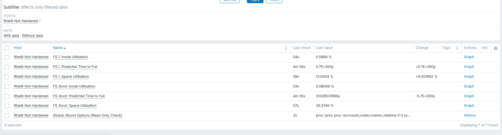
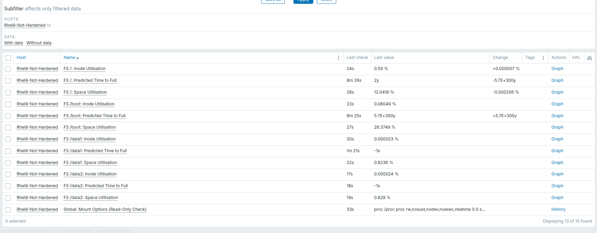
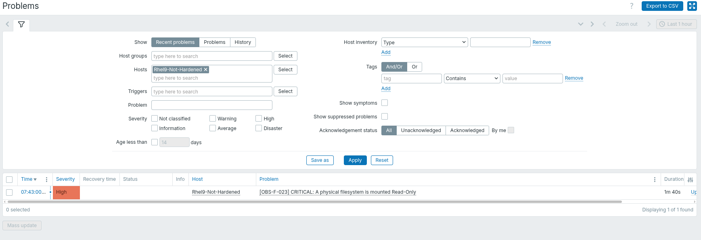

# Test Report: Storage & Filesystem (Cluster 2)

## 1. Architectural Approach

- **Method:** Zabbix Agent 2 (Active Checks) with **Filtered Low-Level Discovery (LLD)**.
- **Justification:** Filesystems are highly dynamic. Hardcoding paths like `/` or `/data` guarantees gaps in monitoring if administrators add new drives. By utilizing LLD filtered strictly to `ext4`, `xfs`, and `btrfs`, the Zabbix agent dynamically discovers and monitors all physical partitions while safely ignoring noisy virtual filesystems (e.g., `tmpfs`).

## 2. Implemented OS-Level Requirements

The following 3 requirements were implemented directly into the OS-level YAML template utilizing the LLD approach:

1. **[OBS-F-021] Filesystem Capacity Trend Monitoring:** Monitors raw Space Utilisation (`vfs.fs.size`) and uses Zabbix's advanced `timeleft()` function to predict if the drive will fill up within the next 7 days.
2. **[OBS-F-022] Inode Utilisation Monitoring:** Monitors index record exhaustion (`vfs.fs.inode`) to prevent write failures.
3. **[OBS-F-023] Filesystem Availability Monitoring:** Monitors `/proc/mounts` globally. If any physical drive crashes and remounts as Read-Only (`ro`), a CRITICAL alert fires instantly.

## 3. Initial Discovery (LLD Proof)

_(The Latest Data screen below validates that the LLD successfully detected the default `/` and `/boot` physical drives and dynamically cloned the rules for each)._

## 4. Dynamic Filesystem Detection (New Disk Validation)

To validate that the LLD architecture scales dynamically, I attached a new 50GB virtual disk to the OS and partitioned it into two separate drives using different architectures:

- **Partition 1 (`/data1`):** A standard `xfs` filesystem.
- **Partition 2 (`/data2`):** A complex Logical Volume (LVM).

_Result:_ The LLD scanner automatically detected both new drives without requiring any modifications to the Zabbix template.

## 5. Filesystem Availability Trigger Validation (Read-Only Test)

To validate that the global mount-options check satisfies **[OBS-F-023]**, I manually forced one of the active data drives into a `Read-Only` state.

- **Action:** Executed `mount -o remount,ro /data1` on the OS.
- **Result:** Zabbix immediately detected the state change in `/proc/mounts` and fired the CRITICAL threshold alert.

## 6. Architecturally Justified Requirements

Because this Proof of Concept is hosted on a Virtual Machine, it evaluates OS-level software rather than physical hardware. The remaining requirements will be monitored at the Bare-Metal or API layer in production:

- **[OBS-F-028] Logical Volume Monitoring (LVM):** Zabbix does not possess a native Go plugin for LVM metadata. This must be satisfied via a secure `UserParameter` invoking the `lvs` command.
- **[OBS-F-025] & [OBS-F-026] Storage Media Health & Redundancy:** VMs abstract SMART controllers and RAID arrays. This must be monitored directly at the Hypervisor (Proxmox/SAN) layer.
- **[OBS-F-027] Storage Latency:** VM kernels (VirtIO) often abstract physical disk read/write millisecond times. Accurate storage latency must be polled from the Bare-Metal Hypervisor.
- **[OBS-F-029], [OBS-F-030], & [OBS-F-031] Backup Operations:** An OS agent cannot know if an external enterprise Backup Server (e.g., Veeam) successfully backed it up. This is solved via Zabbix Trapper (push APIs from the Backup system).
